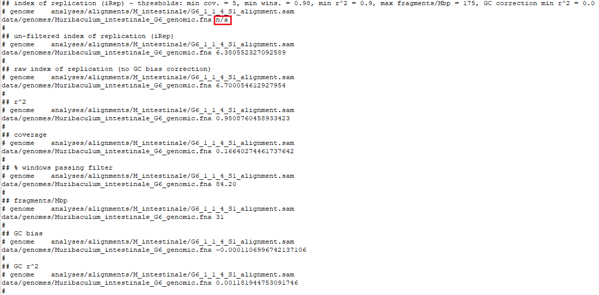

#  Snakemake workflow: *in vivo* bacterial replication rates

### By: Hans Ghezzi - Tropini Lab

[](https://snakemake.github.io)

***

# Project 

This workflow calculates *in vivo* bacterial replication rates from single time point metagenomics sequencing with [iRep](https://github.com/christophertbrown/iRep).

## Overview

The human gut is inhabited by a diverse community of microorganisms, collectively known as the microbiota, which is deeply connected to human health [[1]](#1). In disease, the gut ecosystem experiences drastic perturbations to its physical environment, which can impact both the host and the microbial communities that inhabit it [[2]](#2)[[3]](#3)[[4]](#4). Specifically, physical perturbations can impede bacterial growth by disrupting the specific environmental conditions required by bacteria to survive [[2]](#2). A common perturbation to the gut environment is due to malabsorption, which leads to an increase in gut osmolality, or the number of non-absorbed particles in intestinal contents. Malabsorption is caused by laxative use, food intolerances or inflammatory bowel disease [[2]](#2)[[5]](#5). Gut osmolality increases induce osmotic diarrhea by causing water to exit cells to balance the disrupted osmotic potential [[6]](#6). This also affects the gut microbial communities in a species dependent manner [[2]](#2)[[7]](#7). While we understand the importance of osmotic perturbations, we are still unable to predict gut microbial dynamics in response to malabsorption, which is required for effective microbiota therapy. 

Understanding the impact of the osmolality on the gut microbiota is a necessary step towards developing microbiota-aware precision medicine. This can be achieved by leveraging *in vitro* and *in vivo* models to evaluate gut microbial responses to increased osmotic stress, which will help identify strains that can tolerate and ameliorate malabsorption. Specifically, bacterial abundance and growth rate can be measured as indicators of bacterial responses to osmotic stress. *In vitro* bacterial abundance and growth rate under different osmolalities can be rapidly and easily calculate via simple plate reader experiments. However, assessing these measures *in vivo* is more challenging, as it requires metagenomic sequencing and computational expertise. The lack of bioinformatics expertise could represent a barrier preventing groups from investigating changes in replication rates or relative abundance *in vivo*, thus slowing down progress in the microbiome field. Here, we introduce a snakemake workflow to calculate bacterial replication rates using the tool [iRep](https://github.com/christophertbrown/iRep) [[8]](#8) from single time point metagenomic sequencing. This workflow is currently limited to calculating *in vivo* replication rates for 2 species, *Bacteroides thetaiotaomicron* VPI-5482 and *Muribaculum intestinale* G6, but it will be further developed to allow more flexibility. 

***


# Workflow Overview

This workflow was built using `Snakemake`, a useful tool to create reproducible and scalable data analyses. The workflow is designed to run on a defined set of downloadable FASTQ files and it calculates replication rates for two common gut commensals: *B. thetaiotaomicron* VPI-5482 and *M. intestinale* G6. The reference genome for *B. thetaiotaomicron* is downloaded from NCBI, but the genome for *M. intestinale* is provided as it is not currently publicly available. 

<br />

The key steps of the workflow are listed here:

1. Download FASTQ reads

2. Download reference genomes

3. Perform FASTQ quality control (trimmomatic and BBmap)

4. Index reference genomes (bowtie2)

5. Map reads to indeces (bowtie2)

6. Calculate replication rates (iRep)

<br />

Here is a visualization of the workflow:

 

<br />

**NOTE:** Step 3 of this pipeline, specifically host decontamination with BBmap, is computationally intensive, requiring at least 12G of RAM to successfully run. 

## Dependencies

Installing and running this workflow requires [git](https://git-scm.com/book/en/v2/Getting-Started-Installing-Git) and [conda](https://docs.conda.io/projects/conda/en/latest/user-guide/install/index.html) to be installed by the user.

This snakemake workflow relies on the following main package dependencies:

```sh
python v3.8.12
snakemake v6.10.0
trimmomatic v0.39
bowtie2 v2.4.4
bbmap v38.93
samtools v1.12
iRep v1.1.7
```

## Installation

Make sure you do not have any `conda` environments already activated:

```sh
conda deactivate
```

To access the workflow, clone this repository to your computer by running:

```sh
git clone https://github.com/hans-ghezzi/biof501_HG_term_project.git
```

Navigate to the project directory:

```sh
cd biof501_HG_term_project
```

Create a `conda` environment, called "HG_term_project", using the file `environment.yml`. This will install all the package dependencies required to run the workflow. Refer to the **Troubleshooting** section further below if this step fails.

```sh
conda env create -f environment.yml
```

Activate the `HG_term_project` environment:
```sh
conda activate HG_term_project
```

## Usage


You are now ready to run the workflow! Choose the number of cores snakemake can use to run the workflow based on the computational power available. Indicating more than one core allows snakemake to run parts of the workflow in parallel:

```sh
snakemake --cores 1
```

## Expected outputs

You can check that the workflow ran to completion with 2 quick tests:

<br />

**1) Compare your output tree to the expected output tree shown here:**


<br />


**2) Open the 2 key output files: 1) Bt_1_1_4_S1_iRep.tsv and 2) G6_1_1_4_S1_iRep.tsv and check the iRep values:**

The file **Bt_1_1_4_S1_iRep.tsv** should look like the image below. The key iRep value calculated through this workflow, ~1.54, is boxed in red. 


The file **G6_1_1_4_S1_iRep.tsv** should look like the image below. The key iRep value calculated through this workflow, N/A, is boxed in red. 



If your outputs match the expected outputs in both tests, you can be safe that the pipeline ran to completion successfully!

***

## Troubleshooting

If creating the conda environment from the `environment.yml` failed, you can manually set up the conda environment by installing the required main package dependencies. 

Ensure no environments are active

```sh
conda deactivate
``` 

Create the conda package and install the required dependencies

```sh
conda create -n HG_term_project trimmomatic bowtie2 bbmap irep samtools 
```

Activate the environment

```sh
conda activate HG_term_project
```

Install snakemake

```sh
conda install -c bioconda snakemake=6.10.0
```

You can now go to the `Usage` section to run the pipeline.


## References
<a id="1">[1]</a>
Kho ZY, Lal SK. 2018. The Human Gut Microbiome – A Potential Controller of Wellness and Disease. Front Microbiol.

<a id="2">[2]</a>
Tropini C, Moss EL, Merrill BD, Ng KM, Higginbottom SK, Casavant EP, Gonzalez CG, Fremin B, Bouley DM, Elias JE, Bhatt AS, Huang KC, Sonnenburg JL. 2018. Transient Osmotic Perturbation Causes Long-Term Alteration to the Gut Microbiota. Cell 173:1742-1754.e17.

<a id="3">[3]</a>
Wood JM. 2015. Bacterial responses to osmotic challenges. J Gen Physiol 145:381–388.

<a id="4">[4]</a>
Cesar S, Anjur-Dietrich M, Yu B, Li E, Rojas E, Neff N, Cooper TF, Huang KC. 2020. Bacterial Evolution in High-Osmolarity Environments. mBio 11.

<a id="5">[5]</a>
Juckett G, Trivedi R. 2011. Evaluation of chronic diarrhea. Am Fam Physician 84:1119– 1126.

<a id="6">[6]</a>
Woods TA. 1990. Diarrhea, p. . In Walker, HK, Hall, WD, Hurst, JW (eds.), Clinical Methods: The History, Physical, and Laboratory Examinations, 3rd ed. Butterworths, Boston.

<a id="7">[7]</a>
Gorkiewicz G, Thallinger GG, Trajanoski S, Lackner S, Stocker G, Hinterleitner T, Gülly C, Högenauer C. 2013. Alterations in the Colonic Microbiota in Response to Osmotic Diarrhea. PLoS ONE 8:e55817.

<a id="8">[8]</a>
Brown, C. T., Olm, M. R., Thomas, B. C., & Banfield, J. F. (2016). Measurement of bacterial replication rates in microbial communities. Nature biotechnology, 34(12), 1256–1263. https://doi.org/10.1038/nbt.3704
<br />
